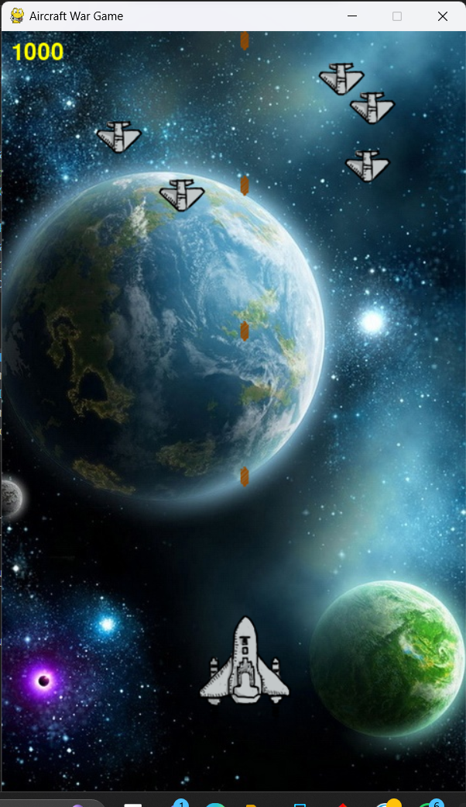

# Aircraft War Game 🚀

The Aircraft War Game is an exciting air combat game developed using Python and the Pygame library. Take control of a fighter aircraft, shoot down opponents, avoid enemy fire, and strive for the highest score!

## Features 🎮

- **Player Aircraft:** Control your aircraft using arrow keys (up, down, left, right) or 'R', 'F', 'D', 'G' keys for movement.
- **Opponent Aircraft:** Enemy aircraft appear randomly, shoot them down to earn points.
- **Bullet Firing:** Shoot bullets using the 'Space' key or automatic firing after a certain interval.
- **Animations:** Explosive animations for destroyed aircraft and wreckages.
- **Scoring System:** Earn points for each opponent aircraft destroyed.
- **Game Over:** Game ends when the player's aircraft is hit by enemy fire.
- **Sound Effects:** Background music, bullet shots, opponent destruction, and game over sounds.

## How to Play 🕹️

1. Clone or download the project files to your local machine.
2. Install Python and the Pygame library if not already installed.
3. Run the `aircraft_war_game.py` file using Python.
4. Use arrow keys or 'R', 'F', 'D', 'G' keys to control your aircraft.
5. Shoot bullets with the 'Space' key to destroy opponent aircraft.
6. Avoid enemy fire and obstacles to stay alive and maximize your score.
7. Enjoy the thrilling air combat experience!

## Screenshots 📸

## Dependencies 🛠️

- Python 3.x
- Pygame library

## Future Enhancements 🚀

- Add multiple levels with increasing difficulty.
- Incorporate power-ups for player upgrades.
- Implement a high score system with leaderboard.
- Include additional enemy types and interactive elements.
- Add settings menu for customization options.

Feel free to contribute, modify, or expand upon this game to enhance its gameplay, graphics, and features!

---

# 💫 About Me:

🚀 As a dynamic Frontend Developer with a passion for crafting exceptional user experiences, I bring 4+ years of expertise to the table. Proficient in HTML, CSS, and JavaScript.   🛠️ My toolkit extends beyond frontend development, encompassing Python, Pandas, and a strong foundation in Data Analysis and Data Science. I thrive in collaborative environments, seamlessly integrating with designers and backend developers to bring innovative ideas to life.  🌐 From responsive design and performance optimization to cross-browser compatibility, I ensure the seamless execution of projects. My attention to detail and dedication to high-quality code have consistently contributed to the success of numerous ventures, driving business growth.  📈 Constantly evolving, I stay at the forefront of industry trends and best practices. Now, I am eager to leverage my diversified skill set in a forward-thinking company that values innovation. Let's connect and explore how I can elevate your team's capabilities and contribute to cutting-edge projects.

## 🌐 Socials:

 

# 💻 Tech Stack:

                            

# 📊 GitHub Stats:

 
 

## 🏆 GitHub Trophies

### ✍️ Random Dev Quote

### 🔝 Top Contributed Repo

### 😂 Random Dev Meme

---

